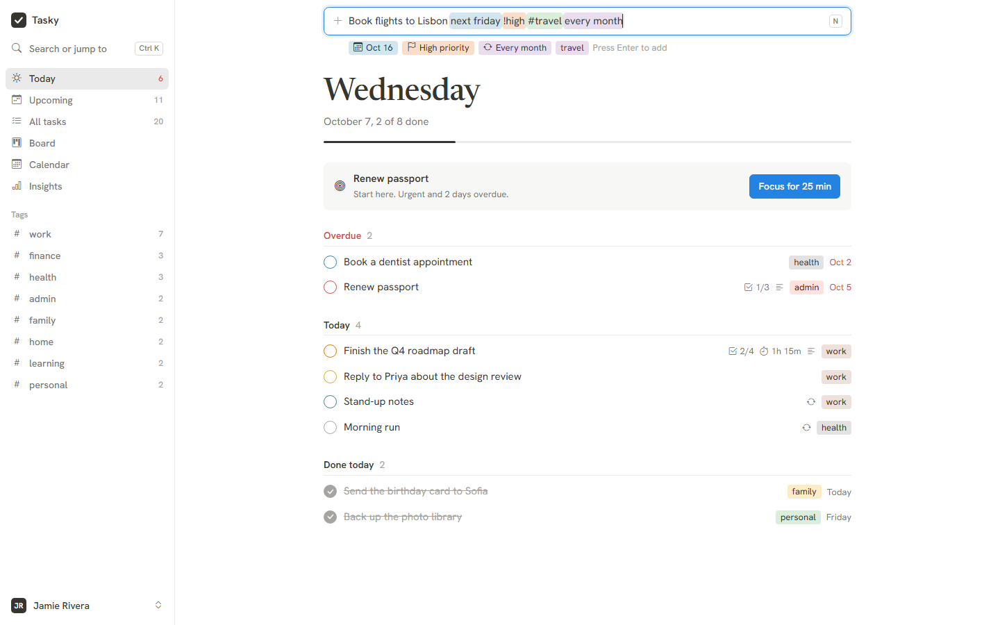
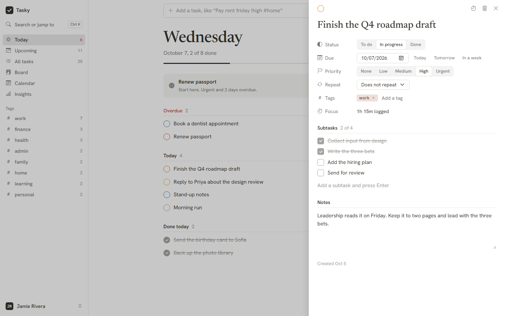
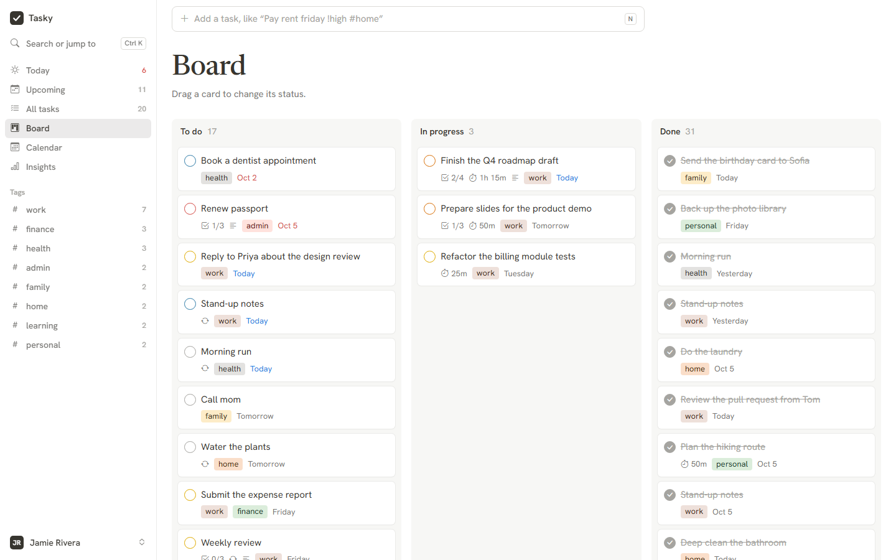
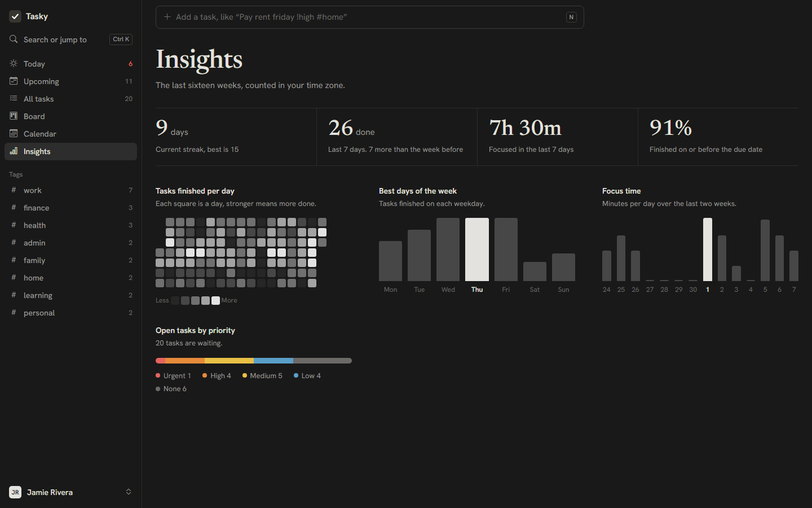
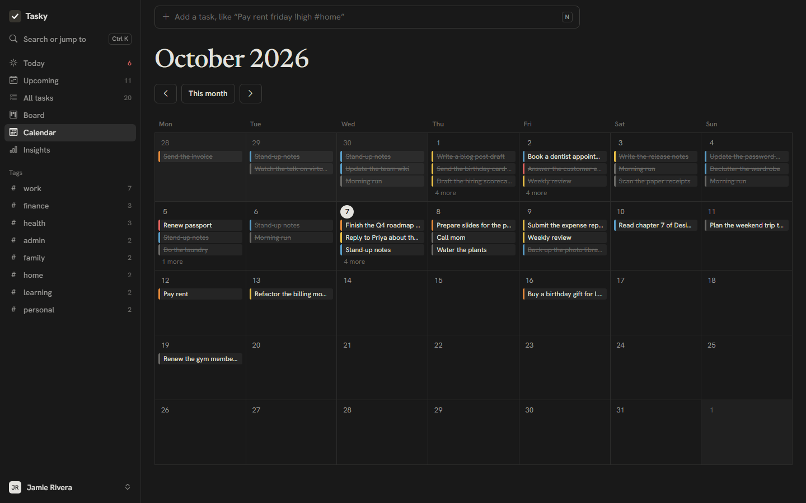
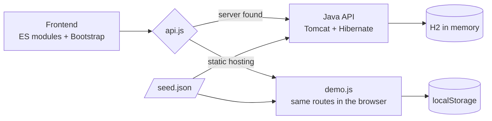

# Tasky

A calm, keyboard-first task manager. Type a task the way you would say it, and Tasky reads the date, priority, tags and repeat, then files it on the right day.

**[Open the live demo](https://krishnapilato.github.io/tasky/#/demo)** · runs entirely in your browser with mock data



Tasky is a Jakarta Servlet and Jakarta Persistence application on **Java 27**, embedded **Tomcat 11**, **Hibernate 7** and an in-memory **H2** database, with a **Bootstrap 5.3.8** frontend written in plain ES modules. No Spring, no build step for the frontend, one executable JAR.

## Features

- **Natural-language quick add.** `Pay rent friday !high #home every month` becomes a high-priority task, tagged `home`, due on Friday, repeating monthly. Recognised words light up as you type.
- **Six views of the same tasks.** Today, Upcoming, All tasks, a drag-and-drop Board, a drag-to-reschedule Calendar, and Insights.
- **A task panel that saves as you go.** Status, due date, priority, repeat, tags, subtasks and notes, in a side panel that never leaves the list.
- **Repeating tasks.** Finishing one schedules the next occurrence. Daily, weekdays, weekly and monthly.
- **Focus sessions.** Start a timer on a task, see it count down in the top bar and the tab title, and have the minutes logged against the task.
- **A suggested starting point.** Today picks the most urgent open task and offers to start a focus session on it.
- **Insights.** Current and best streak, tasks finished this week against last week, focus time, on-time rate, a sixteen-week activity grid and your most productive weekdays.
- **Keyboard first.** A command palette on `Ctrl K`, single-key shortcuts for everything else, and undo on finish and delete.
- **Accounts without email.** Sign-up hands you a one-time recovery key instead of sending mail. It resets a forgotten password and is replaced after use.
- **Light and dark themes** that follow the device or your choice.
- **Your data is portable.** Export everything as JSON, import the open tasks back.

| Task panel | Board |
| --- | --- |
|  |  |

| Insights | Calendar |
| --- | --- |
|  |  |

## Run it

You need JDK 27 and Maven 3.9 or newer.

```bash
mvn package
```

```bash
java --enable-preview -jar target/tasky.jar
```

Open <http://localhost:8080> and choose **Explore with the demo account**, or create your own account. The demo account and its tasks are loaded from [`seed.json`](src/main/resources/web/data/seed.json) every time the server starts, and the database lives in memory, so a restart gives you a clean slate.

| Setting | Default | How to change it |
| --- | --- | --- |
| HTTP port | `8080` | `PORT` environment variable |

While developing, this compiles and starts the server in one step:

```bash
mvn compile exec:exec
```

### With Docker

No JDK or Maven needed. The image builds the JAR on Java 27 and runs it as a non-root user.

```bash
docker build -t tasky .
```

```bash
docker run --rm -p 8080:8080 tasky
```

If port 8080 is busy on your machine, map another one, for example `-p 8081:8080`.

## The demo on GitHub Pages

GitHub Pages serves static files only, so the Java backend cannot run there. Tasky solves this with two interchangeable backends behind one API contract:



- On start the frontend reads `api/meta`. The Java server answers that URL itself. On static hosting the same URL is a small file that says "demo", and the frontend switches to `demo.js`.
- `demo.js` implements the same routes, validation messages, repeat rules and insights as the Java API, and stores everything in `localStorage`.
- Both backends load the same `seed.json`, so the mock account and tasks are identical in both worlds.

To publish it, push to `main` and set **Settings → Pages → Source** to **GitHub Actions**. The [`pages.yml`](.github/workflows/pages.yml) workflow uploads `src/main/resources/web` as the site.

## Java 27 in this codebase

Preview features are enabled at compile time and at run time, which is why the start command carries `--enable-preview`.

| Feature | Status in 27 | Where it is used |
| --- | --- | --- |
| Lazy constants (JEP 531) | preview | Database factory, JSON mapper, signing keys and the time-zone table are created on first use: `Database`, `Json`, `Tokens`, `Exchange` |
| Structured concurrency (JEP 533) | preview | Insights load tasks and focus history in parallel subtasks: `Insights` |
| Primitive types in patterns (JEP 532) | preview | Momentum from a `switch` over an `int`, and safe `long` to `int` narrowing with `instanceof`: `Insights` |
| PEM encodings (JEP 538) | preview | The session verification key is published as PEM at `/api/auth/key`: `Tokens` |
| Scoped values | final | The signed-in session travels with the request and into forked subtasks without parameters: `Session` |
| Virtual threads | final | Every request runs on a virtual thread: `Server` |
| Stream gatherers | final | Weekly windows and running streaks in `Insights`, recovery-key grouping in `RecoveryKeys` |
| Key derivation API | final | Recovery-key fingerprints with HKDF-SHA256: `RecoveryKeys` |
| Module import declarations | final | `import module java.base;` across the codebase |
| Flexible constructor bodies | final | Argument checks before `super(...)`: `Problem` |
| Instance main methods | final | `void main()` in `Tasky` |
| Records, sealed types, record patterns | final | Requests, views and the sealed `Reply` hierarchy that the servlet turns into HTTP responses |
| Unnamed variables | final | Lambdas and catch blocks that ignore a parameter |

The remaining JDK 27 changes need no code. G1 as the default collector everywhere and compact object headers by default apply automatically. Post-quantum hybrid key exchange only concerns TLS connections, and JFR data redaction only concerns flight recordings. The incubating Vector API has no natural use in a task manager, so it is not used.

## API

All routes live under `/api`, speak JSON and identify the caller by an HttpOnly session cookie. Send `X-Time-Zone` with an IANA zone name so that "today" means your today.

| Method | Path | Purpose |
| --- | --- | --- |
| `GET` | `/meta` | Name, version, Java version and storage |
| `POST` | `/auth/register` | Create an account and sign in |
| `POST` | `/auth/login` | Sign in |
| `POST` | `/auth/logout` | Sign out |
| `GET` `PUT` | `/auth/me` | Read or rename the signed-in user |
| `POST` | `/auth/password` | Change the password and end other sessions |
| `POST` | `/auth/recovery-key` | Create a new recovery key |
| `POST` | `/auth/recover` | Reset the password with a recovery key |
| `GET` | `/auth/key` | Public key that verifies session tokens, as PEM |
| `GET` `POST` | `/tasks` | List or create tasks |
| `PUT` `DELETE` | `/tasks/{id}` | Edit or delete a task |
| `POST` | `/tasks/{id}/move` | Change status. Finishing a repeating task returns the next one |
| `POST` | `/focus` | Log focused minutes, optionally against a task |
| `GET` | `/insights` | Streaks, weekly totals, on-time rate and daily activity |

Errors are `{"message": "..."}` with a matching status code.

## Keyboard shortcuts

| Keys | Action |
| --- | --- |
| `N` | Add a task |
| `Ctrl K` or `/` | Search tasks and commands |
| `G` then `T` `U` `A` `B` `C` `I` `S` | Go to Today, Upcoming, All tasks, Board, Calendar, Insights, Settings |
| `J` `K` | Select the next or previous task |
| `Enter` | Open the selected task |
| `X` | Finish or reopen it |
| `F` | Start a focus session on it |
| `Delete` | Delete it |
| `?` | Show the shortcut list |

## Security

- Passwords are stored as PBKDF2-HMAC-SHA256 hashes with 600,000 iterations and a random salt.
- Sessions are Ed25519-signed tokens in an HttpOnly, `SameSite=Strict` cookie. Changing or resetting a password invalidates every earlier token.
- Recovery keys are random, shown once, stored only as an HKDF fingerprint, and single use.
- Sign-in and recovery are throttled after eight failed attempts per account in ten minutes.
- Every task query is scoped to the signed-in user.
- The page ships a Content Security Policy, and Bootstrap and its icons are pinned with Subresource Integrity hashes.

## Project layout

```text
src/main/java/io/github/krishnapilato/tasky
├── Tasky.java          entry point
├── Seed.java           loads the mock account and tasks
├── account/            users, passwords, recovery keys, session tokens
├── task/               tasks, drafts, repeat rules
├── focus/              focus sessions
├── insight/            statistics
├── core/               database, JSON, problems
└── web/                embedded server, routes, HTTP replies

src/main/resources/web
├── index.html
├── css/app.css         theme on top of Bootstrap
├── data/seed.json      mock data shared by both backends
├── api/meta            marks static hosting as demo mode
└── js/
    ├── main.js         start-up and routing
    ├── api.js          picks the Java API or the demo backend
    ├── demo.js         the in-browser backend
    ├── quickadd.js     natural-language parser
    ├── store.js        state and task actions
    ├── parts/          sidebar, task panel, palette, focus timer
    └── views/          one file per screen
```

## Built with

| | Version |
| --- | --- |
| Java | 27 with preview features |
| Tomcat (embedded, Jakarta Servlet 6.1) | 11.0.26 |
| Hibernate ORM (Jakarta Persistence 3.2) | 7.4.12 |
| H2 | 2.5.252 |
| Jackson | 3.2.3 |
| Log4j with SLF4J | 2.26.1 with 2.0.20 |
| Bootstrap and Bootstrap Icons | 5.3.8 and 1.13.1 |

The code carries no comments by design: names, small functions and types are expected to explain themselves.
