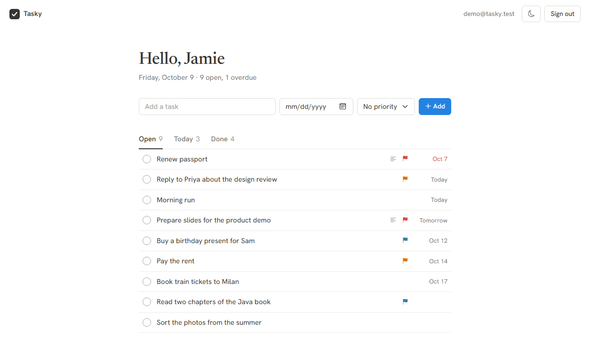
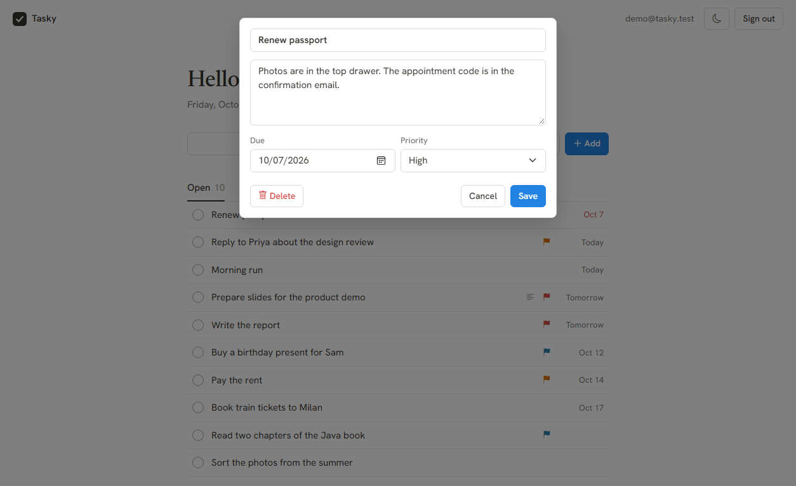
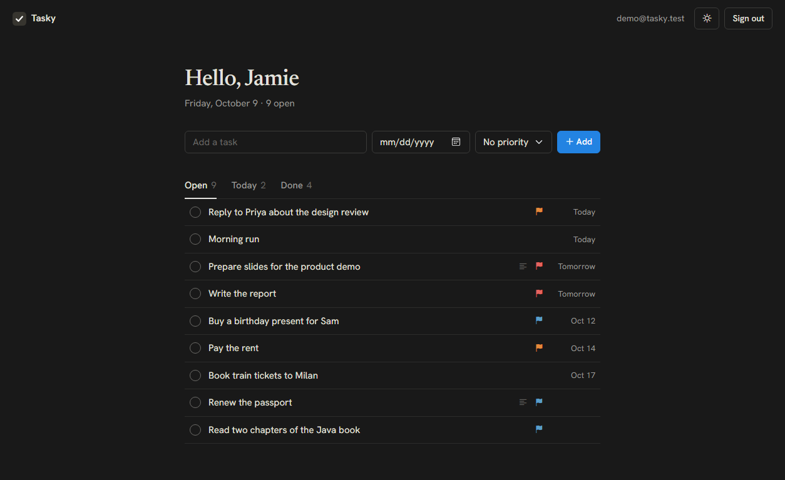

# Tasky

A small task list. Sign in, add tasks with a due date and a priority, and tick them off.

**[Live demo](https://krishnapilato.github.io/tasky/)** · runs in the browser with sample data



| Editing a task | Dark theme |
| --- | --- |
|  |  |

## What it does

- Sign up, sign in and sign out
- Add, edit, finish and delete tasks
- Due dates, with overdue tasks shown in red
- Three priority levels
- Filters for open tasks, tasks due today and finished tasks
- Light and dark theme

## Built with

- Java 27 and plain servlets on embedded Tomcat 11
- Hibernate 7 with an in-memory H2 database
- Jackson 3 for JSON
- Bootstrap 5.3.8 and plain JavaScript, without a build step

There is no Spring in this project.

## Run it

You need JDK 27 and Maven.

```bash
mvn package
```

```bash
java -jar target/tasky.jar
```

Open <http://localhost:8080> and click **Try the demo account**, or create your own account.

The database lives in memory and is filled from [`seed.json`](src/main/resources/web/data/seed.json) on every start, so a restart resets everything. To use another port, set the `PORT` environment variable.

With Docker:

```bash
docker build -t tasky .
```

```bash
docker run --rm -p 8080:8080 tasky
```

## How the demo works without a server

GitHub Pages only serves files, so the Java code cannot run there.

When the page loads it asks for `api/account`. The Java server answers that request itself. On GitHub Pages the same address is a small file that says `"demo": true`, and the page then uses [`demo.js`](src/main/resources/web/js/demo.js) instead of the server. It has the same routes and the same messages as the Java API, but keeps the data in `localStorage`. Both versions load the same `seed.json`.

## API

| Method | Path | What it does |
| --- | --- | --- |
| `GET` | `/api/account` | Tells who is signed in |
| `POST` | `/api/account/register` | Creates an account and signs in |
| `POST` | `/api/account/login` | Signs in |
| `POST` | `/api/account/logout` | Signs out |
| `GET` `POST` | `/api/tasks` | Lists or adds tasks |
| `PUT` `DELETE` | `/api/tasks/{id}` | Changes or deletes a task |

Errors come back as `{"message": "..."}`. Passwords are stored as salted PBKDF2 hashes, and the session cookie is `HttpOnly` and `SameSite=Strict`.

## Project layout

```text
src/main/java/io/github/krishnapilato/tasky
├── Tasky.java        starts the app
├── Seed.java         loads the sample account and tasks
├── Database.java     Hibernate and H2 setup
├── Passwords.java    password hashing
├── Json.java         JSON settings
├── model/            User and Task
└── web/              Tomcat setup and the two servlets

src/main/resources/web
├── index.html
├── css/app.css
├── data/seed.json    sample data for both versions
├── api/account       tells the page it runs without a server
└── js/
    ├── app.js        the page logic
    ├── api.js        talks to the server or to demo.js
    ├── demo.js       replaces the server on GitHub Pages
    └── theme.js      picks light or dark
```
